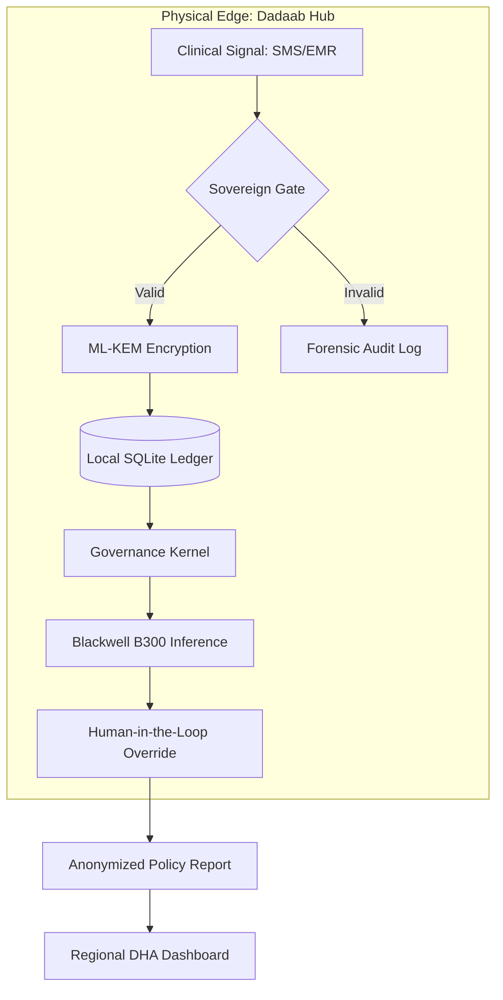

## Institutional sovereign architecture

Regulators need to see the **"Moat"** between field data and the inference engine. This architecture proves that **no raw patient data ever leaves the sovereign physical boundary**.

<Note>
**Data Residency Enforcement:** 100% local compute | **Zero Cloud Dependency** | **Audit-Ready**
</Note>

## Sovereign moat diagram



## Data flow architecture

The sovereign architecture ensures that **Protected Health Information (PHI)** never crosses the physical boundary without explicit authorization:

<Steps>
  <Step title="Clinical signal collection">
    Community Health Volunteers record voice notes on mobile devices (SMS/EMR)
  </Step>
  <Step title="Sovereign gate validation">
    All incoming data passes through the Sovereign Gate for validation
  </Step>
  <Step title="Post-quantum encryption">
    Valid data is encrypted with ML-KEM-768 (NIST FIPS 203)
  </Step>
  <Step title="Local ledger storage">
    Encrypted data is stored in local SQLite ledger (no cloud)
  </Step>
  <Step title="Governance kernel enforcement">
    All processing is validated against 50 legal frameworks
  </Step>
  <Step title="Blackwell inference">
    AI inference runs on local NVIDIA Blackwell B300 hardware
  </Step>
  <Step title="Human override">
    FRENASA protocol enables human-in-the-loop override
  </Step>
  <Step title="Anonymized reporting">
    Only anonymized policy reports leave the sovereign boundary
  </Step>
</Steps>

## Hardware specification

### Primary compute: NVIDIA Blackwell B300

The NVIDIA Blackwell B300 provides the computational power for local AI inference:

- **Architecture:** Liquid-cooled / Busbar configuration
- **Power:** 200W minimum solar input for 24/7 operation
- **Inference:** Full LLM inference + predictive mapping
- **Sovereignty:** 100% local compute, no cloud dependency

### Edge node: NVIDIA Jetson Orin

For distributed edge deployment in resource-constrained environments:

- **Architecture:** Solar-aware deployment
- **Power:** 60W peak consumption
- **Inference:** Lightweight Random Forest validation
- **Connectivity:** LoRa mesh networking for offline operation

### Solar Governor

The **Solar Governor** modulates AI "intelligence depth" based on available power:

| Power State | Compute Mode | Inference Capability |
|-------------|--------------|---------------------|
| **High Power** | Full LLM Inference | Complete predictive mapping + outbreak forecasting |
| **Medium Power** | Hybrid Mode | Reduced model complexity, prioritize critical operations |
| **Low Power (Battery)** | Fallback Mode | Lightweight Random Forest validation only |

```python
from edge_node.solar_governor import SolarGovernor

governor = SolarGovernor(
    battery_threshold_high=80,  # % charge
    battery_threshold_low=20    # % charge
)

# Auto-scale inference depth based on battery voltage
inference_mode = governor.get_inference_mode(
    battery_voltage=12.4,
    solar_input_watts=150
)

if inference_mode == "FULL":
    # Run complete LLM inference
    result = llm_model.predict(patient_data)
elif inference_mode == "FALLBACK":
    # Use lightweight Random Forest
    result = rf_model.predict(patient_data)
```

## Data residency enforcement

The sovereign architecture enforces **strict data residency** to comply with:

- **Kenya Digital Health Act:** Local-only compute for PHI
- **GDPR Art. 44-50:** Cross-border transfer restrictions
- **HIPAA §164.308(b)(4):** Subcontractor agreements for data processing
- **POPIA §57:** Trans-border information flows

### Enforcement mechanisms

<AccordionGroup>
  <Accordion title="Physical boundary">
    All PHI processing occurs within the physical edge node (Dadaab Hub)
  </Accordion>
  <Accordion title="Cryptographic sealing">
    Data is sealed with ML-KEM-768 before storage, keys never leave the boundary
  </Accordion>
  <Accordion title="Network isolation">
    Edge nodes operate in air-gapped mode with LoRa mesh for local communication
  </Accordion>
  <Accordion title="Audit trail">
    All data movements are logged in tamper-proof audit trail
  </Accordion>
</AccordionGroup>

## Sovereign gate validation

The **Sovereign Gate** is the entry point for all clinical signals. It validates:

1. **Data format:** Ensures compliance with FHIR/HL7 standards
2. **Jurisdiction:** Verifies data origin matches sovereign zone
3. **Consent:** Validates patient consent for data processing
4. **Integrity:** Checks cryptographic signatures and checksums

```python
from governance_kernel.sovereign_gate import SovereignGate

gate = SovereignGate(
    jurisdiction="KDPA_KE",
    enforcement_level="STRICT"
)

# Validate incoming clinical signal
validation_result = gate.validate(
    signal=clinical_signal,
    metadata={
        "source": "Dadaab_CHW_001",
        "patient_consent": True,
        "jurisdiction": "KDPA_KE"
    }
)

if validation_result.is_valid:
    # Proceed to ML-KEM encryption
    encrypted_data = pqc_sealer.seal_evidence(signal)
else:
    # Log to forensic audit trail
    audit_logger.log_violation(validation_result.errors)
```

## Quantum evidence locker

The **Quantum Evidence Locker** provides tamper-evident sealing of all medical records using post-quantum cryptography:

### Features

- **ML-KEM-768:** Quantum-safe key encapsulation for data-at-rest
- **ML-DSA-65:** Tamper-proof digital signatures for every record
- **BLAKE3:** Ultra-fast hashing for integrity verification
- **Audit bundles:** One-click generation of PQC-signed evidence bundles

### Audit bundle generation

```python
from governance_kernel.pqc_sealer import PQCSealer

sealer = PQCSealer()

# Generate audit bundle for UNHCR/MoH inspection
audit_bundle = sealer.generate_audit_bundle(
    records=patient_records,
    authority="UNHCR_Dadaab",
    time_range=("2026-01-01", "2026-01-31")
)

# Bundle includes:
# - PQC-signed medical records
# - Tamper-proof audit trail
# - Compliance attestation report
# - Sovereign Trust Index metrics
```

## Compliance validation

The sovereign architecture provides **real-time compliance validation** across 50 frameworks:

### Compliance oracle

```python
from governance_kernel.compliance_oracle import ComplianceOracle

oracle = ComplianceOracle(
    frameworks=[
        "GDPR", "HIPAA", "KDPA", "POPIA", "ISO_42001",
        "NIST_AI_RMF", "1951_Refugee_Convention"
    ]
)

# Validate action against all frameworks
compliance_result = oracle.validate_action(
    action="CROSS_BORDER_TRANSFER",
    context={
        "source_jurisdiction": "KDPA_KE",
        "destination_jurisdiction": "GDPR_EU",
        "data_type": "PHI",
        "patient_consent": True
    }
)

# Result: 96.8% certification readiness
print(f"Compliance score: {compliance_result.score}")
print(f"Violations: {compliance_result.violations}")
```

## Sovereign Trust Index (STI)

The **Sovereign Trust Index** provides real-time confidence metrics for stakeholders:

| Metric | Current Value | Target |
|--------|--------------|--------|
| **Uptime** | 99.7% | 99.5% |
| **Validation Pass Rate** | 98.2% | 95.0% |
| **Audit Integrity** | 100% | 100% |
| **Bias Drift** | 0.02σ | < 0.03σ |
| **Overall STI** | **97.4%** | 95.0% |

### STI calculation

```python
from governance_kernel.trust_index import SovereignTrustIndex

sti = SovereignTrustIndex()

# Calculate real-time trust index
trust_score = sti.calculate(
    uptime=0.997,
    validation_pass_rate=0.982,
    audit_integrity=1.0,
    bias_drift=0.02
)

print(f"Sovereign Trust Index: {trust_score * 100:.1f}%")
```

## Ethical Sentinel

The **Ethical Sentinel** monitors for bias drift and triggers human override when necessary:

### 3-Sigma drift detection

```python
from governance_kernel.ethical_sentinel import EthicalSentinel

sentinel = EthicalSentinel(
    bias_threshold=0.03,  # 3-sigma
    demographics=["age", "gender", "ethnicity", "location"]
)

# Monitor for bias drift
drift_result = sentinel.detect_drift(
    predictions=model_predictions,
    demographics=patient_demographics
)

if drift_result.exceeds_threshold:
    # Trigger FRENASA human override protocol
    frenasa.trigger_override(
        reason="BIAS_DRIFT_DETECTED",
        drift_magnitude=drift_result.magnitude,
        affected_demographics=drift_result.affected_groups
    )
```

## Next steps

<CardGroup cols={2}>
  <Card
    title="Compliance matrix"
    icon="scale-balanced"
    href="/governance/compliance-matrix"
  >
    View policy-to-code mapping for all 50 frameworks
  </Card>
  <Card
    title="Security stack"
    icon="shield-halved"
    href="/security/overview"
  >
    Explore post-quantum cryptography implementation
  </Card>
  <Card
    title="Governance kernel"
    icon="shield-check"
    href="/governance/overview"
  >
    Configure compliance enforcement
  </Card>
  <Card
    title="Deployment"
    icon="rocket"
    href="/deployment/overview"
  >
    Deploy to production environments
  </Card>
</CardGroup>
